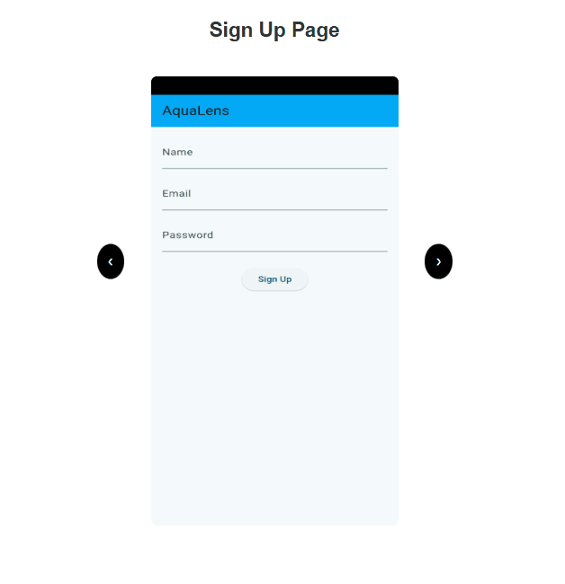

# AquaLens - Water Quality Monitoring App

AquaLens is a flutter-based Android application designed to measure water quality parameters such as Suspended Particulate Matter (SPM) and Turbidity using citizen science and remote sensing technologies. This app empowers users to contribute to environmental monitoring by collecting and analyzing water quality data.

## Developing a Flutter Project Using Visual Studio Code
This guide will walk you through the steps to set up, develop, and run a Flutter project using Visual Studio Code (VS Code). Follow these steps to get started:

**Step 1:** Install Flutter and Dart SDK
1. **Download Flutter SDK:**
   - Visit the official Flutter website: https://flutter.dev.
   - Download the Flutter SDK for your operating system (Windows, macOS, or Linux).
2. **Extract the Flutter SDK:**
   - Extract the downloaded Flutter SDK to a location on your system (e.g., C:\flutter on Windows or /Users/your-username/flutter on macOS/Linux).
3. **Add Flutter to PATH:**
   - Add the Flutter SDK's bin directory to your system's PATH environment variable.
   - Example (for macOS/Linux):```export PATH="$PATH:`pwd`/flutter/bin"```
   - Example (for Windows): Open Environment Variables and add ```C:\flutter\bin``` to the PATH.
4. Verify Installation:
   - Run the following command to verify the installation:<br/>
     ```flutter doctor```

## **Screenshots**
Check out the carousel showcasing the app screenshots: 
<div align="center">
  
</div>

## **Technologies**
- **Flutter**: For cross-platform mobile app development.
- **Dart**: The programming language used for Flutter.
- **Google Firebase**: For backend services including authentication, database, and firebase storage.
- **OpenCV**: For image processing and analysis.

## **Installation**
- Clone the repository<br/> `https://github.com/umer-saleem/aqua-sense.git`

## **Demo**
