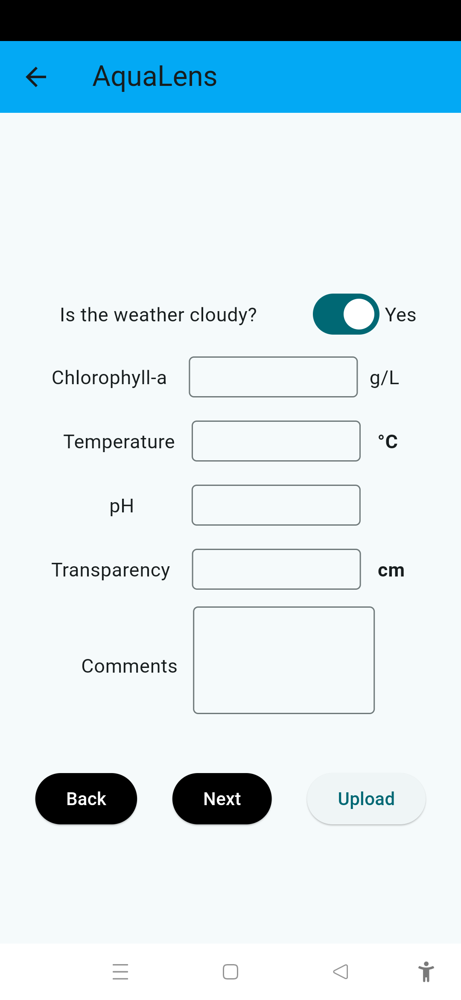

# AquaLens - Water Quality Monitoring App

AquaLens is a flutter-based Android application designed to measure water quality parameters such as Suspended Particulate Matter (SPM) and Turbidity using citizen science and remote sensing technologies. This app empowers users to contribute to environmental monitoring by collecting and analyzing water quality data.

## **Screenshots**

https://umer-saleem.github.io/aqua-sense/screenshots.html

## **Screenshots**

  

    

      <input type="radio" name="carousel" id="slide1" checked>
      <input type="radio" name="carousel" id="slide2">
      <input type="radio" name="carousel" id="slide3">
      <input type="radio" name="carousel" id="slide4">
      <input type="radio" name="carousel" id="slide5">
      <input type="radio" name="carousel" id="slide6">
      <input type="radio" name="carousel" id="slide7">
      <input type="radio" name="carousel" id="slide8">
      

        

          
        

        

          
        

        

          
        

        

          
        

        

          
        

        

          
        

        

          
        

        

          
        

      

      

        <label for="slide1" class="nav-dot"></label>
        <label for="slide2" class="nav-dot"></label>
        <label for="slide3" class="nav-dot"></label>
        <label for="slide4" class="nav-dot"></label>
        <label for="slide5" class="nav-dot"></label>
        <label for="slide6" class="nav-dot"></label>
        <label for="slide7" class="nav-dot"></label>
        <label for="slide8" class="nav-dot"></label>
      

    

  

  

